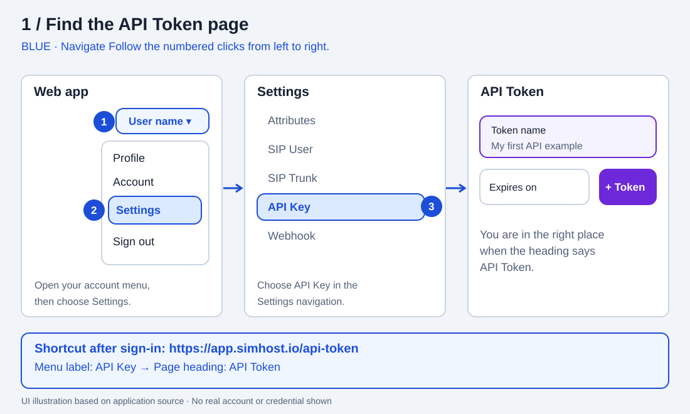
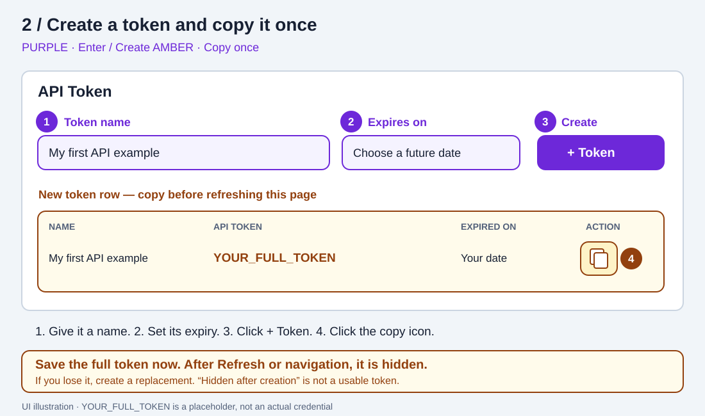
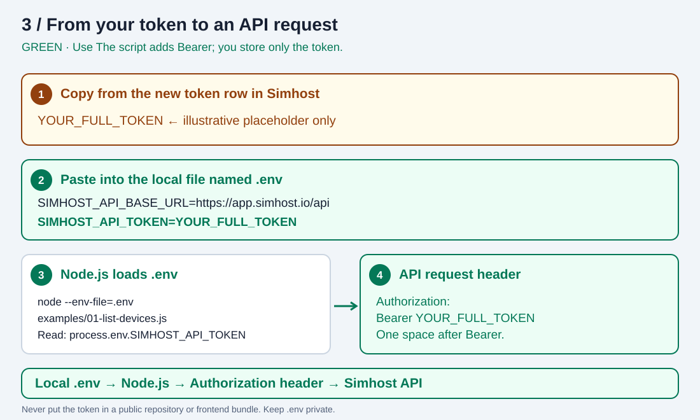

# Simhost API examples

Learn how to connect JavaScript to the Simhost User API. Start by creating an API token, saving it locally, and making a read-only request to list your assigned devices.

**An API token is a secret credential that lets a script act as your Simhost user.** Your script sends it with each API request. You do not put your Simhost password in the script.

## Start here

1. [Find the API Token page](#1-find-the-api-token-page).
2. [Create and copy your token](#2-create-and-copy-your-token).
3. [Save it in `.env`](#3-save-your-token-in-env).
4. [Run your first JavaScript request](#4-run-your-first-javascript-request).
5. [Use the token directly in an API request](#5-use-the-token-directly-in-an-api-request).
6. [Fix common setup problems](#6-troubleshooting).

You need a Simhost account, access to the [Simhost web app](https://app.simhost.io), and Node.js 22 or later for the JavaScript example. You can check Node.js in a terminal with `node --version`. Get Node.js from the [official download page](https://nodejs.org/en/download) if needed.

The diagrams below are **annotated UI illustrations based on the application source**, not screenshots of a live account. Layout may vary by screen size or deployed version. All token values shown are placeholders.

| Color and label | Meaning |
| --- | --- |
| **Blue · Navigate** | Where to click in the web app |
| **Purple · Enter / Create** | Fields to fill in and the button that creates a token |
| **Amber · Copy once** | Copy the full token before refreshing or leaving |
| **Green · Use** | Save the token locally and send it in an API request |

Each diagram also uses numbered labels, so you can follow the steps without relying on color alone.

## 1. Find the API Token page



1. Sign in to [app.simhost.io](https://app.simhost.io).
2. Click your **name or initials in the top-right corner** to open the account menu. On a narrow screen, only your initials may be visible.
3. Click **Settings**.
4. In the Settings navigation, click **API Key**.
5. Confirm that the page heading is **API Token**. The menu says **API Key**, but the page says **API Token**; both refer to this feature.

Once signed in, you can also open the [API Token page directly](https://app.simhost.io/api-token).

**Choose the Simhost “API Key” navigation item.** The Settings page also has an OpenAI integration field used for AI-written SMS drafts. That field does not create a Simhost API token.

## 2. Create and copy your token



1. Under **Token name**, enter a descriptive label, such as `My first API example`. This is a label to help you recognize the token later; it is not the token itself.
2. Under **Expires on**, choose a future date. The current UI preselects a date roughly 30 days ahead. After expiration, scripts using this token will need a replacement token.
3. Click the purple **+ Token** button. If it is disabled, check that you entered a name and selected an expiry date.
4. A new row appears in the table. The app displays the message: **“API token created. Copy it now; it is shown only once.”**
5. In that new row, click the **copy icon** under **Action**, beside the trash icon. Copy the **full token**, not its name or identifier.
6. Save the token in your local `.env` file as described below **before** clicking Refresh, reloading the page, or navigating away.

**The full token is shown only immediately after creation.** Later, the API Token column may say `Hidden after creation`. That text is not a credential, and copying it will not work. If you did not save the original token, create a replacement and revoke the unused one.

To revoke a token, find its row, click the **trash icon**, and confirm. Scripts using that token will no longer authenticate. When replacing a token used by an existing integration, update the integration and verify the replacement before revoking the old token.

## 3. Save your token in `.env`

The filename is **`.env`**: a leading dot, followed by `env`. It is not `.evn`, `env`, or `.env.txt`.



### Download the examples

Clone this repository and open its folder in your terminal:

```sh
git clone https://github.com/b60coder/simhost.git
cd simhost
```

If you already downloaded it, open that folder instead. Alternatively, use GitHub's **Code → Download ZIP**, extract the ZIP, and open the extracted folder in your terminal.

### Create the local settings file

On macOS or Linux:

```sh
cp .env.example .env
```

On Windows PowerShell:

```powershell
Copy-Item .env.example .env
```

Open `.env` in your code editor. Replace `PASTE_YOUR_FULL_TOKEN_HERE` with the full token you just copied:

```dotenv
SIMHOST_API_BASE_URL=https://app.simhost.io/api
SIMHOST_API_TOKEN=PASTE_YOUR_FULL_TOKEN_HERE
```

| Setting | What to enter |
| --- | --- |
| `SIMHOST_API_BASE_URL` | Use `https://app.simhost.io/api` for the hosted service. Keep the `/api` suffix and do not append an endpoint here. |
| `SIMHOST_API_TOKEN` | The full copied token only. Do not include `Bearer`, the token label, or the entire `Authorization` header. |

Keep the token on one line. Save the file in the repository root, next to `package.json`:

```text
simhost/
├── .env               ← your local token goes here
├── .env.example       ← placeholders only; safe to share
├── .gitignore         ← excludes .env from Git
├── package.json
├── README.md
├── docs/images/
└── examples/
    └── 01-list-devices.js
```

**Keep `.env` private.** This repository's `.gitignore` excludes it. Never paste a real token into GitHub, screenshots, support messages, or browser frontend code. If you accidentally share it, revoke it and create a replacement. You can verify the ignore rule with `git check-ignore .env`; it should print `.env`.

## 4. Run your first JavaScript request

From the repository folder, run:

```sh
npm run devices
```

No `npm install` is needed for this example: it uses Node.js built-in `fetch`. The equivalent command is:

```sh
node --env-file=.env examples/01-list-devices.js
```

The `--env-file=.env` option tells Node.js to load the settings file. Simply creating `.env` does not make Node.js read it automatically.

The script calls:

```http
GET https://app.simhost.io/api/user/api/v1/devices
Authorization: Bearer YOUR_FULL_TOKEN
Accept: application/json
```

This request lists devices assigned to your user. It does not send SMS, switch eSIM profiles, or start campaigns. A successful result prints:

```text
HTTP 200 — authentication succeeded.
```

The JSON response follows that line. Its contents depend on your account. An empty device list can be a valid result when no devices are assigned to you; device assignment and live availability are separate things.

The key lines in [the example](examples/01-list-devices.js) are:

```js
const token = process.env.SIMHOST_API_TOKEN;

// The script adds "Bearer " here. Store only the token itself in .env.
const response = await fetch(
  'https://app.simhost.io/api/user/api/v1/devices',
  {
    headers: {
      Authorization: `Bearer ${token}`,
      Accept: 'application/json',
    },
  },
);
```

There is exactly one space between `Bearer` and the token. The credential belongs in an HTTP **header**, not in the request body. Use this code in Node.js on your computer or backend; do not embed a private token in a public website.

## 5. Use the token directly in an API request

### In Postman or a similar API client

1. Create a new HTTP request.
2. Set the method to **GET**.
3. Enter `https://app.simhost.io/api/user/api/v1/devices` as the URL.
4. Open the **Authorization** tab and choose **Bearer Token**.
5. Paste the full token into the **Token** field. Paste only the token: the client adds `Bearer` for you.
6. Click **Send** and inspect the status code and JSON response.

If you enter headers manually instead, use a header named `Authorization` with the value `Bearer YOUR_FULL_TOKEN`. Choose either the Bearer Token form or the manual header, so you do not add duplicate authentication headers.

### With cURL on macOS or Linux

If you used the two-line `.env` format above, this command reads it, exports the values for this command group, and makes the same read-only request:

```sh
(
  set -a
  . ./.env
  set +a
  curl --fail-with-body --silent --show-error \
    --header "Authorization: Bearer ${SIMHOST_API_TOKEN}" \
    --header 'Accept: application/json' \
    "${SIMHOST_API_BASE_URL}/user/api/v1/devices"
)
```

Run it from the repository folder. Source only your own trusted `.env` file: shell sourcing interprets its contents as commands. This shell example is for macOS/Linux; use the Node.js command above on Windows.

### Where exactly does the token go?

| Place | Correct value |
| --- | --- |
| `.env` variable `SIMHOST_API_TOKEN` | `YOUR_FULL_TOKEN` |
| Postman **Bearer Token → Token** field | `YOUR_FULL_TOKEN` |
| HTTP **Authorization** header | `Bearer YOUR_FULL_TOKEN` |
| Token name in the Simhost UI | A label such as `My first API example`; never use this label as authentication |

`YOUR_FULL_TOKEN` and `PASTE_YOUR_FULL_TOKEN_HERE` are placeholders. Neither will authenticate.

## 6. Troubleshooting

| What you see | What to check |
| --- | --- |
| `node: command not found` or Node is not recognized | Install Node.js 22 or later, then reopen your terminal. |
| `bad option: --env-file` | Your Node.js version is too old. Check `node --version` and use Node.js 22 or later. |
| `.env` cannot be found | Run from the repository root. Confirm the name is `.env`, not `.evn` or `.env.txt`. |
| `Set SIMHOST_API_TOKEN…` | Replace the placeholder in `.env` with your full token and save the file. |
| HTTP **401** | The token may be missing, incomplete, expired, or revoked. Do not use `Hidden after creation`, a token label, or a token UUID. Create a replacement if needed. |
| HTTP **403** | Check whether your user has access to the requested operation. |
| HTTP **404**, or HTML instead of JSON | Check the URL. For this example, the full URL ends in `/api/user/api/v1/devices`. |
| HTTP **503**, network error, or timeout | Check connectivity and service availability, then retry the read-only device request. |
| Success, but no devices | Authentication worked; check whether devices have been assigned to your user. |
| You changed `.env` but the old token is still used | A previously exported `SIMHOST_API_TOKEN` can override the file. On macOS/Linux run `unset SIMHOST_API_TOKEN`; on PowerShell run `Remove-Item Env:SIMHOST_API_TOKEN -ErrorAction SilentlyContinue`, then rerun. |
| The token disappeared after Refresh | This is expected. Full tokens are available only when created. Use your saved copy or create a replacement. |

When requesting help, share the command, endpoint, status code, and a redacted error message. Remove tokens, phone numbers, and other private account data.

## Example roadmap

The first runnable example is device listing. The remaining tutorials are planned:

| Example | Purpose | Status |
| --- | --- | --- |
| [List devices](examples/01-list-devices.js) | Verify authentication and list assigned devices | Included |
| Send SMS | Send a message through an assigned device | Planned |
| List eSIM profiles | Inspect profiles on each device | Planned |
| Enable an eSIM profile | Switch the enabled profile within a device | Planned |
| Create an SMS campaign | Prepare a campaign and its recipients | Planned |
| Start an SMS campaign | Explicitly trigger a prepared campaign | Planned |
| Monitor an SMS campaign | Inspect progress and recipient results; explain usage fields exposed by the API | Planned |

For endpoint definitions, request fields, and responses, see the [Simhost API reference](https://openapi.simhost.io/).
